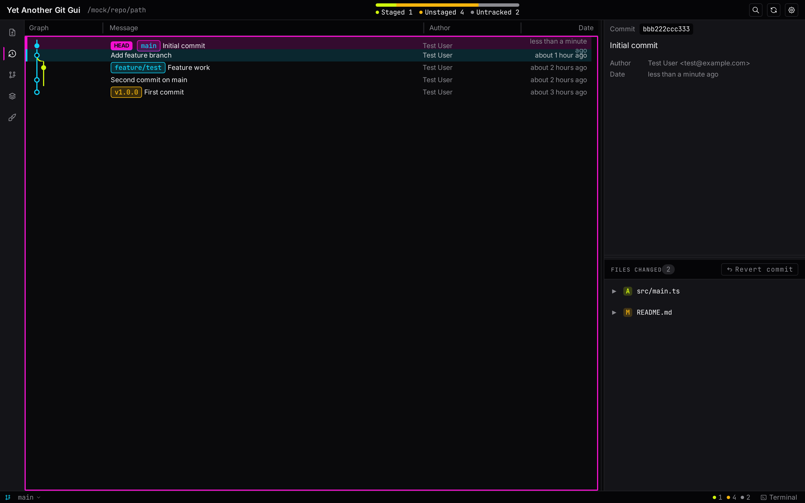
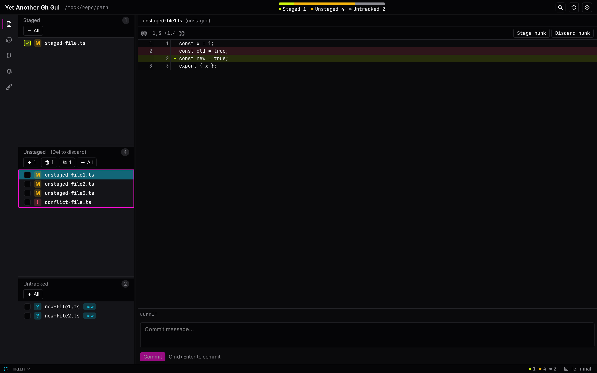
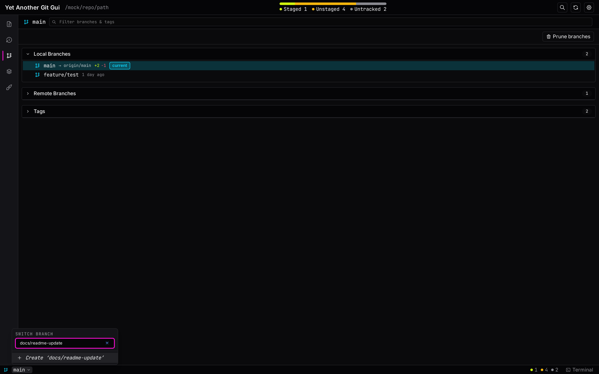
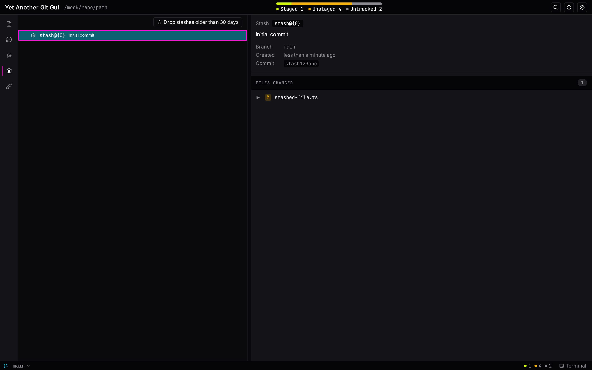
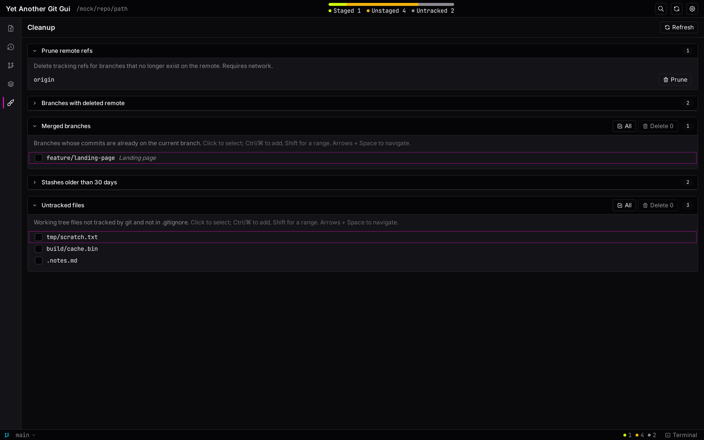
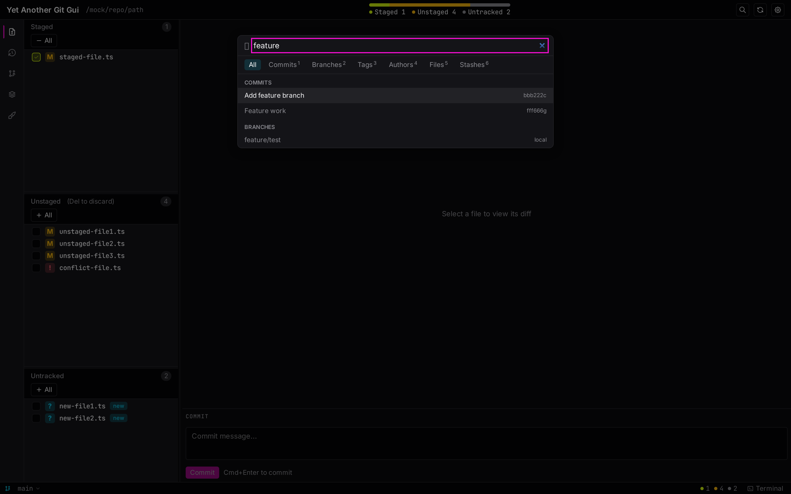
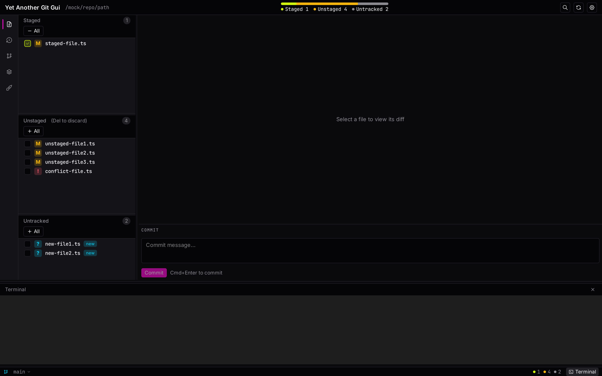
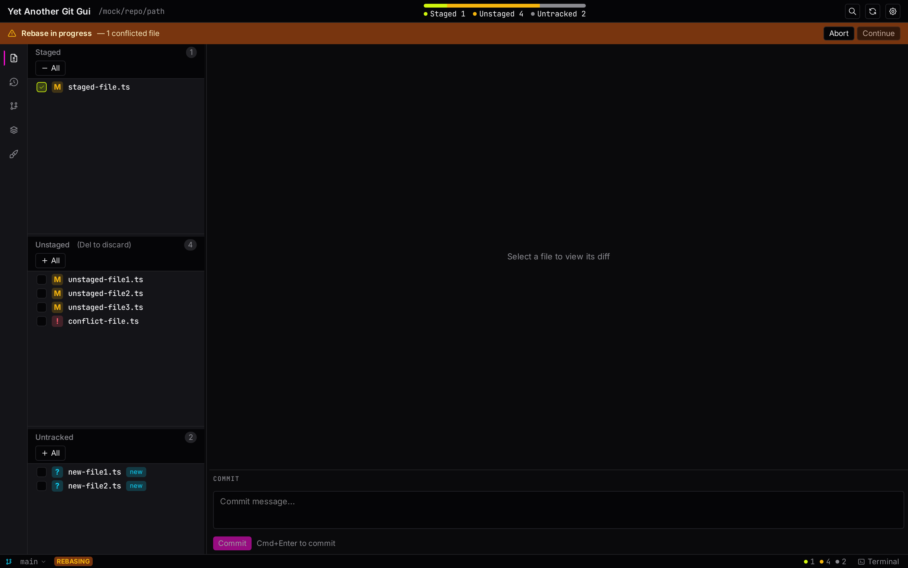
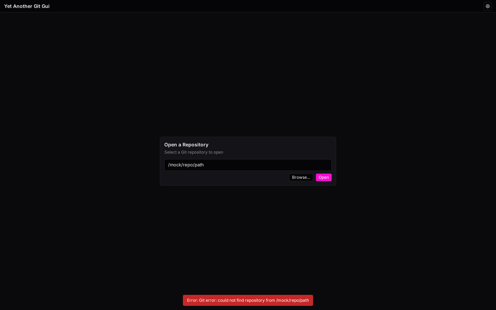

# Yet Another Git Gui

A Git GUI for macOS and Linux built with Tauri 2.0. It's meant to sit alongside the `git` CLI and cover the parts that are nicer in a GUI — reading the commit graph, staging hunks, resolving conflicts, browsing stashes — without trying to replace the CLI for everything else.

| History | Status |
| :---: | :---: |
|  |  |

## What it does

- **Inspect history** — commit graph with branch and merge lines, commit details panel, files changed per commit, right-click context menu (copy hash, checkout, revert).
- **Stage and commit** — file-level, hunk-level, and line-level staging; discard hunks or selected lines; commit message editor.
- **Branches and tags** — current-branch indicator, prune-deleted-remote button, and a quick-swap dropdown that filters as you type and offers to create the branch if the name doesn't exist.
- **Stashes** — list with a details panel showing the files in each stash; apply, drop.
- **Cleanup view** — one place to prune remote refs, delete branches whose remote was deleted or that are merged, drop stashes older than 14 days, and remove untracked files. Each section is multi-select with a bulk action.
- **Command palette** — `Cmd/Ctrl+K` searches commits (hash + message), branches, tags, authors, files, and stashes; number keys 1–6 switch filter tabs.
- **Embedded terminal** — xterm.js panel at the bottom, toggled with `` Cmd/Ctrl+` ``.
- **Revert** — a whole commit, a single file from a commit, or selected lines from a file in a commit. The result is staged for review before you commit it.
- **Open repositories** — landing screen with a path input / file picker when launched without a repo, or `yagg [path]` from the CLI.
- **Settings** — density (compact / comfortable / spacious), text size, theme, auto-update toggle, and a "Install CLI Tool" affordance on macOS.
- **Updates** — auto-update on macOS and Linux where the platform supports it, with an in-app dialog.

## Screenshot tour

### History

Commit graph with refs, selectable rows, and a details panel that lists files changed in the selected commit with a Revert button.


### Status

Working copy split into Staged, Unstaged, and Untracked. The diff viewer on the right supports per-hunk and per-line staging or discard, and the commit message editor lives at the bottom.


### Branches and tags

Collapsible Local / Remote / Tags sections, a `Prune branches` button for branches whose remote was deleted, and a quick-swap dropdown (bottom-left) that filters branches as you type and offers `Create '<name>'` when the typed name doesn't exist yet.



### Stashes

Stash list on the left, details on the right (branch, created time, commit hash, files changed).



### Cleanup

Grouped candidates for safe-ish cleanup: prune remote refs, branches with deleted remote, merged branches, old stashes, and untracked files. Each section is multi-select with its own delete button.



### Command palette

`Cmd/Ctrl+K` opens a single search box across commits, branches, tags, authors, files, and stashes. Filter chips at the top (and number keys `1`–`6`) narrow the result type.



### Embedded terminal

A docked xterm.js panel for the times a GUI shortcut doesn't exist. Toggle with `` Cmd/Ctrl+` `` or the status-bar button.



### Conflict / rebase state

When the repo is mid-rebase, mid-cherry-pick, or mid-revert, a banner across the top shows the state, the conflict count, and explicit Abort and Continue buttons. Continue stays disabled until all conflicts are resolved.



### Welcome screen

What you see when you launch without a repo (or pass a path that isn't one). Type a path or click Browse.



## Keyboard shortcuts

| Shortcut | Action |
| --- | --- |
| `Cmd/Ctrl+K` | Open command palette |
| `Cmd/Ctrl+L` | Switch to History view |
| `Cmd/Ctrl+R` or `F5` | Refresh repository |
| `` Cmd/Ctrl+` `` | Toggle terminal panel |
| `↑` / `↓` | Move selection in lists |
| `Space` | Toggle stage / select for the focused item |
| `Enter` | Activate the focused item |
| `Delete` | Discard (unstaged) or unstage (staged) |
| `Shift+↑` / `Shift+↓` | Extend selection range |
| `Cmd/Ctrl+A` | Select all in the focused list |

## Install

### Linux

```bash
# Debian / Ubuntu
sudo dpkg -i Yet.Another.Git.Gui_*.deb

# Fedora / RHEL
sudo rpm -i Yet.Another.Git.Gui_*.rpm

# Any distro (AppImage)
chmod +x Yet.Another.Git.Gui_*.AppImage
./Yet.Another.Git.Gui_*.AppImage
```

The `.deb` and `.rpm` packages install a `yagg` command on `$PATH`:

```bash
yagg                  # open the current directory
yagg /path/to/repo    # open a specific repo
```

### macOS

1. Open the `.dmg` and drag **Yet Another Git Gui** to Applications.
2. Launch it. The first launch may be blocked by Gatekeeper — see [Troubleshooting](#troubleshooting) for the two ways around that.
3. Click **Install CLI Tool** in the Settings menu to put `yagg` on your `$PATH`.

### From source

Prerequisites: Node.js 22+, Rust (stable), and the platform-specific [Tauri prerequisites](https://tauri.app/start/prerequisites/).

```bash
git clone https://github.com/mywill/YetAnotherGitGui.git
cd YetAnotherGitGui
pnpm install
pnpm tauri dev          # development with hot reload
pnpm tauri build        # production bundle
```

## Develop

```bash
pnpm tauri dev          # run the app
pnpm test               # frontend unit tests (Vitest)
pnpm test:e2e           # E2E tests (Playwright, uses mocked Tauri)
cd src-tauri && cargo test
pnpm check              # lint + type check + tests
```

See [CONTRIBUTING.md](CONTRIBUTING.md) for the full guide, including the optional Podman-based container setup for contributors and AI agents, the commit-message convention used for releases, and the CI matrix. [TESTING.md](TESTING.md) covers test patterns, coverage targets, and the accessibility checks.

## Project status

This is a side project, not a commercial product. It does the subset of Git operations I personally want a GUI for; for anything beyond that, drop into the terminal — the embedded terminal panel exists for exactly that reason. Issues and PRs are welcome.

## Troubleshooting

### macOS: "Cannot be opened because Apple cannot verify it"

The app isn't signed with an Apple Developer certificate, so Gatekeeper blocks the first launch. Either:

- **Right-click the app in Finder → Open**, then click Open in the dialog. One-time only.
- Or remove the quarantine flag:

  ```bash
  xattr -cr /Applications/Yet\ Another\ Git\ Gui.app
  ```

### Linux: "No display server"

You need a graphical session. Over SSH, use X11 forwarding or VNC.

### Build fails with missing system libraries

Install the platform-specific [Tauri prerequisites](https://tauri.app/start/prerequisites/).

## License

MIT — see [LICENSE](LICENSE).

## Related docs

- [CONTRIBUTING.md](CONTRIBUTING.md) — dev setup, commit conventions, optional container
- [TESTING.md](TESTING.md) — test patterns and coverage
- [SECURITY.md](SECURITY.md) — vulnerability reporting and dependency-cooldown policy
- [CHANGELOG.md](CHANGELOG.md) — release notes
- [AGENTS.md](AGENTS.md) — guidance for AI coding agents working on this repo
